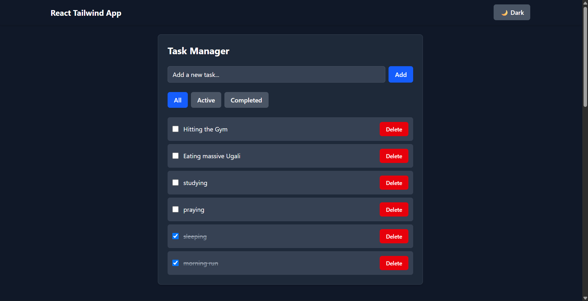
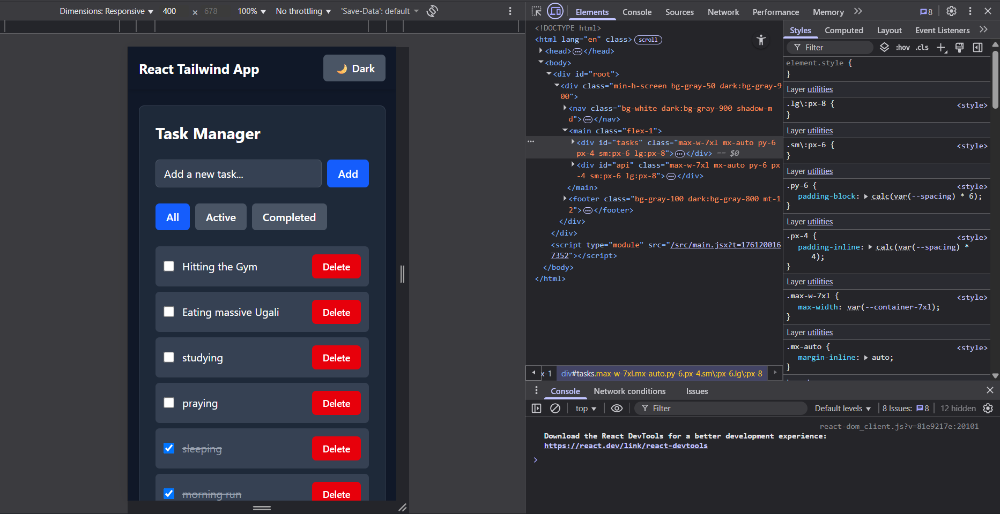

# React Tailwind Assignment - Week 3

A responsive React application built with JSX and Tailwind CSS, demonstrating component architecture, state management, hooks usage, and API integration.

## 🚀 Features

### Component Architecture
- **Button Component**: Reusable button with primary, secondary, and danger variants
- **Card Component**: Content display component with customizable layout
- **Navbar Component**: Site navigation with theme toggle
- **Footer Component**: Site footer with links and copyright
- **Layout Component**: Main layout wrapper including navbar and footer

### State Management & Hooks
- **TaskManager Component**: Full CRUD operations for tasks
  - Add new tasks
  - Mark tasks as completed
  - Delete tasks
  - Filter tasks (All, Active, Completed)
- **useState**: Managing component state
- **useEffect**: Side effects for loading saved tasks
- **useContext**: Theme management (light/dark mode)
- **useLocalStorage**: Custom hook for persisting tasks

### API Integration
- **ApiData Component**: Fetches data from JSONPlaceholder API
- Loading and error states handling
- Search functionality to filter API results
- Responsive grid layout for data display

### Styling with Tailwind CSS
- Responsive design (mobile, tablet, desktop)
- Dark/Light theme switcher using Tailwind's dark mode
- Utility-first CSS approach
- Custom animations and transitions

## 🛠️ Tech Stack

- **React 19.1.1**: Modern React with hooks
- **Vite 7.1.7**: Fast build tool and dev server
- **Tailwind CSS 4.1.15**: Utility-first CSS framework
- **ESLint**: Code linting
- **PostCSS**: CSS processing

## 📦 Installation

1. Clone the repository:
```bash
git clone <repository-url>
cd react-tailwind-assignment
```

2. Install dependencies:
```bash
npm install
```

3. Start the development server:
```bash
npm run dev
```

4. Open [http://localhost:5173](http://localhost:5173) in your browser

## 🏗️ Build for Production

```bash
npm run build
```

Preview the production build:
```bash
npm run preview
```

## 🚀 Deployment

The application is deployed and can be accessed at: [https://your-deployed-url.com](https://your-deployed-url.com)

## 📱 Screenshots

### Light Mode


### Dark Mode


### Mobile View

## 📁 Project Structure

```
react-tailwind-assignment/
├── public/
│   └── vite.svg
├── src/
│   ├── api/
│   │   └── fetchPosts.js
│   ├── components/
│   │   ├── ApiData.jsx
│   │   ├── Button.jsx
│   │   ├── Card.jsx
│   │   ├── Footer.jsx
│   │   ├── Layout.jsx
│   │   ├── Navbar.jsx
│   │   └── TaskManager.jsx
│   ├── context/
│   │   └── ThemeContext.jsx
│   ├── hooks/
│   │   └── useLocalStorage.js
│   ├── App.css
│   ├── App.jsx
│   ├── index.css
│   └── main.jsx
├── dist/ (build output)
├── package.json
├── tailwind.config.js
├── postcss.config.js
├── vite.config.js
└── README.md
```

## 🎯 Key Features Demonstrated

1. **Component Composition**: Modular, reusable components
2. **State Management**: Local state with hooks and context
3. **API Integration**: RESTful API consumption with error handling
4. **Responsive Design**: Mobile-first approach with Tailwind
5. **Theme Switching**: Dark/light mode implementation
6. **Custom Hooks**: Reusable logic extraction
7. **Modern React**: Hooks, functional components, JSX

## 🔧 Development

### Available Scripts

- `npm run dev` - Start development server
- `npm run build` - Build for production
- `npm run preview` - Preview production build
- `npm run lint` - Run ESLint

### Code Quality

The project uses ESLint for code quality and follows React best practices.

## 📄 License

This project is part of a learning assignment and is not licensed for commercial use.

## 👥 Author

[Your Name] - Week 3 Assignment Submission
